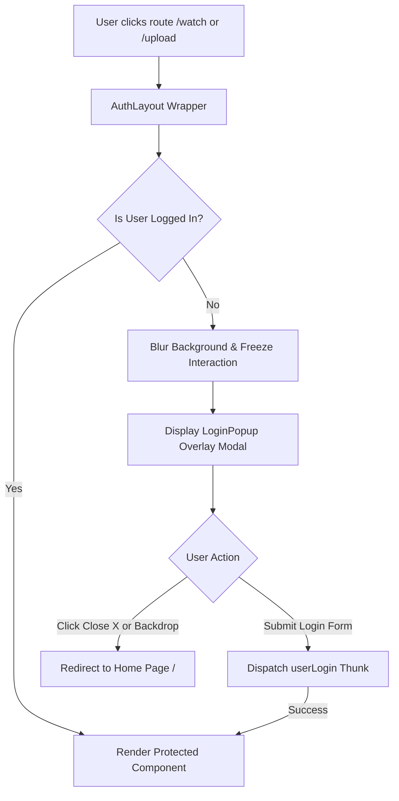
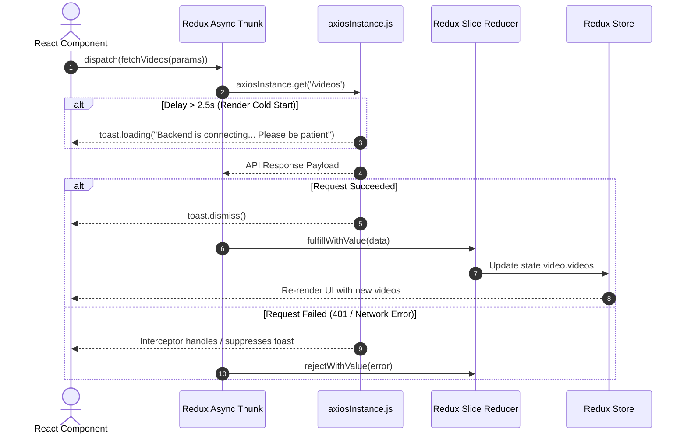

# Video Mela - Frontend Web Application

A modern, highly responsive Single-Page Application (SPA) for **Video Mela**—a full-featured video streaming platform built with React 18, Vite, Redux Toolkit, React Hook Form, and Tailwind CSS.

---

## 🔗 Quick Links
- **Frontend GitHub Repo**: [https://github.com/vikrant48/Video_Mela_frontend](https://github.com/vikrant48/Video_Mela_frontend)
- **Backend GitHub Repo**: [https://github.com/vikrant48/Video_Mela_backend](https://github.com/vikrant48/Video_Mela_backend)
- **Data Model Workspace**: [Eraser.io Design Workspace](https://app.eraser.io/workspace/OO3HFmjKmUYmLl8JiwRk?origin=share)

---

## 🛠️ Technology Stack

- **Framework & Runtime**: React 18 & Vite
- **State Management**: Redux Toolkit & React-Redux
- **Routing**: React Router DOM v6
- **Styling**: Tailwind CSS & Vanilla CSS
- **Form Handling**: React Hook Form
- **HTTP Client**: Axios with custom interceptors
- **Icons & UI Utilities**: React Icons (`react-icons/io5`, `react-icons/fa`, `react-icons/ci`, `react-icons/md`) & `react-hot-toast`

---

## 📊 Application Architecture & Diagrams

### 1. Route Protection & Auth Popup Flow

---

### 2. Redux Toolkit Data & API Flow

---

